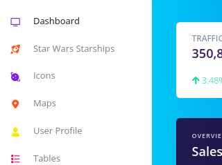

## How to run this sample

1. Clone or download this repository
   `git clone https://github.com/karthikeyan-live/beeliked.git beeliked-challenge`
2. Move to the project folder
   `cd beeliked-challenge`
3. Install the dependencies
   `npm i`
4. Run the sample
   `npm start`
5. Open the url http://localhost:3000/ to see the output.

## The Challenge

1. Clone and install the Creative Tim’s “Argon Dashboard React” repository
   https://github.com/creativetimofficial/argon-dashboard-react
   The dashboard will be used as a base for this test.
2. Create a new page named “Star Wars Starships” and add it to the left menu of the
   dashboard.
3. Create a table to list Star Wars Starships with the 4 columns:

- Name
- Model
- Created Date
- Cost in Credits
- The table can be based in one of the Argon Dashboard “Tables view” examples. Feel
  free to improve and create more components as needed.

4. Consume the Star Wars Starships API endpoint and populate the table with the respective data.
   https://swapi.dev/api/starships/
5. Add a button outside the table to create a new Starship and make it open a Bootstrap modal with a form containing:

- Name
- Model
- Created Date
- Cost in CreditsPlus the buttons:
- Create
- Cancel

6. Make the modal “Create” button add a new Starship to the top of the table.
7. Add a new column to the table which will contain an “Edit” button for each of the listed
   Starships.
8. Make the “Edit” button load a Bootstrap modal with the same form structure as the
   create modal, but having an “Update” button instead of “Create”.
9. Make the modal “Update” button update the respective table row with the new data.
10. Be sure everything is working, review and refactor your code if needed.

## About my Solution  
    

- **Create a new page named “Star Wars Starships” and add it to the left menu of the
  dashboard.** 
  Created a menu item as mentioned, used the _Nucleo - spaceship_ icon 
  
  
- **Create a table to list Star Wars Starships with the 4 columns** 
  Used the same table from the Argon Dashboard “Tables view” example. Loaded the data in the constructor using fetch api. 
  (Note: If we have more api interactions or for scalablity, we shall move the api calls separately (say, services/api/starship.js) and consume it).
  
- **Consume the Star Wars Starships API endpoint and populate the table with the respective data.** 
  For simplicity considered "Name" as the key/id, as the key/id is not available in the web API response data. 
  (But the best approach is to set some custom key/id using some tools like [uuid](https://www.npmjs.com/package/uuid)). 
  

- **Add a button outside the table to create a new Starship and make it open a Bootstrap modal** 
Created a custom modal as a presentation component. This modal can be used for both creating and editing the Starship. 
  

- **Make the modal “Create” button add a new Starship to the top of the table.** 
   
  

- **Add a new column to the table which will contain an “Edit” button for each of the listed Starships.** 
  

- **Make the “Edit” button load a Bootstrap modal with the same form structure as the create modal, but having an “Update” button instead of “Create”.** 
As I considered Name as the key/id, I made it as read-only. 
   

- **Make the modal “Update” button update the respective table row with the new data.** 
  

### Additional Improvements
- **Pagination** 
Implemented the pagination option for the table. During pagination, fresh copy of the data from the server is updated in the table. 
  
